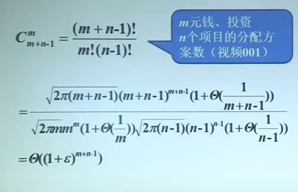
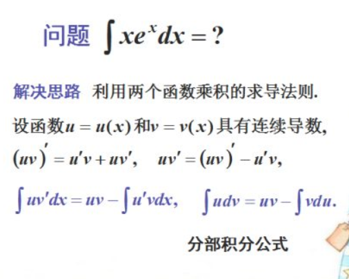
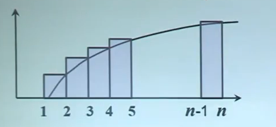
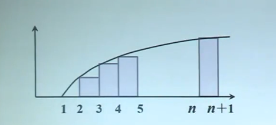
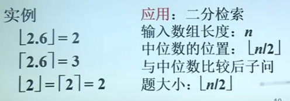
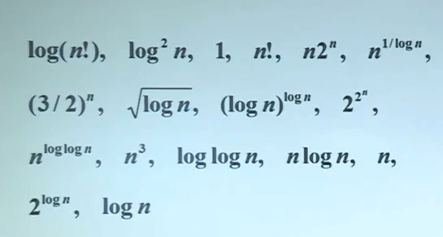
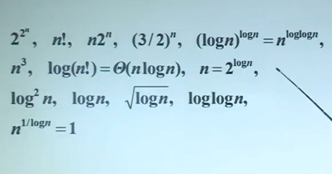

# 几类重要的函数

## 基本函数类

阶的函数

至少指数级:$2^n,3^n,n!$

多项式级:$n,n^2,n\log n,n^{1/2}$

对数多项式级：$logn,log^2n,loglogn$

ps:证明阶乘的阶大于指数级:
$$
0\leq \lim_ {n\rightarrow\infty}\frac{a^n}{n!}\leq \lim_ {n\rightarrow\infty}\frac{a*a*...*a}{1*2*...*a}*\frac{a*a*...*a}{(a+1)*...*n}=
$$

$$
\lim_ {n\rightarrow\infty}M*\frac{a}{a+1}*...\frac{a}{n}\leq \lim_ {n\rightarrow\infty}M*\frac{a}{n}=0
$$

## 对数函数

==符号==：

- $logn=log_2n$
- $log^kn=(logn)^k$
- $loglogn=log(logn)$

==性质==:

- $log_2n=\Theta(log_ln)$
- $log_bn=o(n^a)$
- $a^{log_bn}=n^{log_ba}$

有关性质1的证明
$$
\log_kn=\frac{\log_ln}{\log_lk},\log_lk为常数
$$

$$
\lim_{n\rightarrow\infty}\frac{\log_kn}{\log_ln}=\lim_{n\rightarrow\infty}\frac{log_ln}{\log_lk*\log_ln}=\frac{1}{\log_lk}
$$

根据定理，$log_kn=\Theta(log_ln)$

### 有关性质2的证明

$$
\lim_{n\rightarrow\infty}\frac{log_bn}{n^a}=\lim_{n\rightarrow\infty}\frac{b^n}{b^{n^a}}=\lim_{n\rightarrow\infty}\frac{1}{b^{n^{a-1}}}=0
$$

$$
\therefore log_bn=o(n^a)
$$

### 有关性质3的证明

$$
\because log_bnlog_ba=log_balog_bn
$$

$$
\therefore a^{log_bn}=n^{log_ba}
$$

## 指数函数与阶乘

### String公式(斯特灵)：

$$
n!=\sqrt{2\pi n}(\frac{n}{e})^n(1+\Theta(\frac{1}{n}))
$$

$n!=o(n^n)$

$n!=\omega(2^n)$

$log(n!)=\Theta(nlogn)$

## $\log(n!)=\Theta(n\log n)$的证明

数学基础：分部积分法

$$
\int \ln xdx=x\ln x-\int xd\ln x
$$

$$
=x\ln x-x+C
$$

下界

$$
\log(n!)=\sum_ {k=1}^{n}\log k （矩形面积之和）\geq \int_{1}^{n}\log xdx  (积分)
$$

$$
=\log e(n\ln n-n+1)=\Omega(n\log n)
$$

上界：

$$
\log(n!)=\sum_{k=1}^{n}\log k=\leq \int_{2}^{n+1}\log xdx=O(n\log n)
$$

## 取整函数

### 取整函数的定义:

$\lceil x\rceil$:表示大于等于x的最小整数

$\lfloor x\rfloor$:表示小于等于x的最大整数

### 应用与实例

## 取整函数的性质

1. $x-1<\lfloor x\rfloor \leq x \leq \lceil x\rceil \leq x+1$
2. $\lfloor x+n \rfloor = \lfloor x\rfloor+n,\lceil x+n \rceil=\lceil x\rceil+n,n\in Z^+$
3. $\lceil \frac{n}{2}+\frac{n}{2}\rceil=n$
4. $\lceil \frac{\lceil \frac{n}{a}\rceil}{b}\rceil=\lceil \frac{n}{ab}\rceil,\lfloor \frac{\lfloor \frac{n}{a}\rfloor}{b}\rfloor=\lfloor \frac{n}{ab}\rfloor$

## 例：按照阶排序

