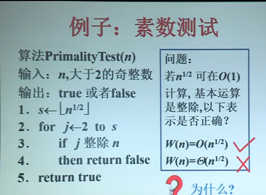
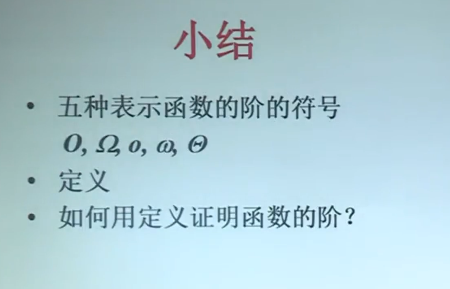

# 函数渐进的界

## 大O符号（渐进上界）

> ==定义==：设f和g是定义域为自然数集N上的函数。若存在正数==c==和$n_0$使得对一切$n\geq n_0$，有

$$
0\leq f(n)\leq c g(n)
$$

成立，则称f(n)的渐近上界是g(n)

记作：
$$
f(n)=O(g(n))
$$

### 例子：

设$f(n)=n^2+n$则：

​	$f(n)=O(n^2)$，取c=2，$n_0$=1即可

​	$f(n)=O(n^3)$，取c=1，$n_0=2$即可

1. $f(n)=O(g(n))$，f(n)的阶不高于g(n)的阶
2. 可能存在多个正数c，只要指出一个即可
3. 对前面有限个值可以不满足不等式
4. 常函数可以写作O(1)

## 大$\Omega$符号 （渐进下界）

==设定：==设f和g是定义域为自然数集==N==上的函数。若存在正数==c==和==$n_0$==，使得对一切==$n \geq n_0$==有
$$
0\leq cg(0) \leq f(n)
$$
成立，则称f(n)的渐进的下界是g(n)，

记作：
$$
f(n)=\Omega (g(n))
$$

### 例子

设$f(n)=n^2+n$，则

​	$f(n)=\Omega (n^2)$，取c=1，$n_0$=1即可

​	$f(n)=\Omega (100n)$，取，c=1/100，$n_0$=1即可

1. $f(n)=\Omega (g(n))$，f(n)的阶不低于g(n)的阶
2. 可能存在多个正数c，指出一个即可
3. 对前面有限个n值，可以不满足上述不等式

## 小o符号（完全上界）

==设定==：设f和g是定义域为自然数集N 上的函数，若对于==任意==正数c都存在$n_0$，使得对于一切$n\geq n_0$有
$$
0\leq f(n) <cg(n)
$$
成立，则记作
$$
f(n)=o(g(n))
$$

### 例子：

$f(n)=n^2+n$，则

$f(n)=o(n^3)$

- 当$c\geq 1$显然成立，$\because n^2+2<cn^3(n_0=2)$
- 当$1>c>0$，取$n_0>[2/c]$即可，

$\because$

$cn\geq cn_0 >2$	当（$n\geq n_0$）

$n^2+n<2n^2<cn^3$

1. $f(n)=o(g(n))$,f(n)的阶低于g(n)的阶
2. 对于不同正数c，$n_0$不一样，c越小$n_0$越大
3. 对前面有限个n值可以不满足不等式

## 小$\omega$符号（完全下界）

==定义：==设f和g是定义域为自然数集N上的函数，若对于==任意正数c==都存在$n_0$，使得一切$n\geq n_0$有
$$
0 \leq cg(n) <f(n)
$$
成立，则记作
$$
f(n)= \omega (g(n))
$$

### 例子

设$f(n)=n^2+n$，则
$$
f(n)=\omega (n)
$$
但是不可以写$f(n)=\omega(n^2)$,因为取c=2，不存在$n_0$使得对一切$n\geq n_0$有下式成立
$$
cn^2=2n<n^2+n
$$

1. $f(n)=\omega (g(n)) $，f(n)的阶高于g(n)的阶
2. 对不同的正数c，$n_0$不等，c越大$n_0$越大
3. 对前面有限个n值可以 不满足不等式

## $\Theta $符号

若$f(n)=O(g(n))$且$f(n)=\Omega(g(n))$,

则记作：
$$
f(n)=\Theta(g(n))
$$

### 例子

$f(n)=n^2+n,g(n)=100n^2$，那么有
$$
f(n)=\Theta (g(n))
$$

1. f(n)的阶与g(n)的阶相等
2. 对前面有限个n的值可以不满足条件

## 例子：素数测试

##  小结

