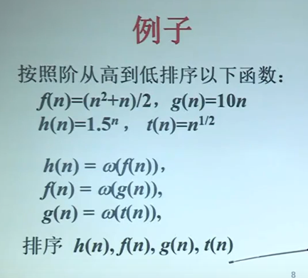
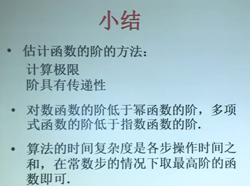

# 有关函数渐进的界的定理

## 定理1(极限和函数的阶)

==设：==f和g是定义域为自然数集合的函数

1. 如果$\lim_{n\rightarrow \infty}{f(n)/g(n)}$存在，并且等于某个常数c>0，那么$f(n)=\Theta(g(n))$  //两者阶相等
2. 如果$\lim_{n\rightarrow \infty}{f(n)/g(n)}=0$,那么$f(n)=o(g(n))$  //g(n)为f(n)的完全上界
3. 如果$\lim_{n\rightarrow\infty}{f(n)/g(n)}=+\infty$，那么$f(n)=\omega(g(n))$  //g(n)为f(n)的完全下界

## 证明定理1（1）

根据极限定义，对于给定正数$\epsilon$存在某个$n_0$,只要$n\geq n_0$，就有
$$
\because \lim_ {n\rightarrow\infty}{f(n)/g(n)}=c,
$$

$$
\therefore |f(n)/g(n)-c| < \epsilon
$$

$$
\therefore c-\epsilon <f(n)/g(n)<c+ \epsilon
$$

取$\epsilon =c/2$,
$$
c/2 <f(n)/g(n)<3c/2<2c
$$
故：对于所有$n\geq n_0$,$f(n)\leq 2cg(n)$,于是$f(n)=O(g(n))$,

​	对于所有$n\geq n_0$,$f(n)\geq \frac{c}{2}g(n)$，于是，$f(n)=\Omega(g(n))$

从而

$f(n)=\Theta(n^2)$.

## 例：估计函数的阶

## 一些重要的结果

可证明：==多项式函数的阶低于指数函数的阶==
$$
n^d =o(r^n),r>1,d>0
$$
证：不妨设d为正整数
$$
\lim_ {n\rightarrow\infty}{\frac{n^d}{r^n}}=\lim_ {n\rightarrow\infty}{\frac{dn^d-1}{r^nlnr}}=\lim_  {n\rightarrow\infty}{\frac{d(d-1)n^d-2}{r^n(lnr)^2}}=...
$$

$$
=\lim_{n\rightarrow\infty}{\frac{d!}{r^n(lnr)^d}}=0
$$

即$\frac{n^d}{r^n}=0$,根据定理1（2）,多项式函数的阶低于指数函数的阶

## 一些重要的结果（2）

证明：==对数函数的阶低于幂函数的阶==
$$
ln n=o(n^d),d>0
$$
证
$$
\lim_{n\rightarrow\infty}{\frac{ln n}{n^d}}=\lim_{n\rightarrow\infty}{\frac{\frac{1}{n}}{dn^{d-1}}}=\lim_{n\rightarrow\infty}{\frac{1}{dn^d}}=0
$$

## 定理2(传递性定理)

==设==：函数f，g，h的定义域为自然数集合

1. 如果$f=O(g)$,且$g=O(h)$,那么$f=O(h)$
2. 如果$f=\Omega(g)$,且$g=\Omega(h)$,那么$f=\Omega(h)$
3. 如果$f=\Theta(g)$,且$g=\Theta(h)$,那么$f=\Theta(h)$

## 定理3（和的定理）

==假设==：函数f和g的定义域为自然数集，若对某个其他函数g，有$f=O(h)$,和$g=O(h)$

那么
$$
f+g=O(h)
$$
该性质可以推广到有限个函数

算法由有限个步骤组成。若每一步的时间复杂度的函数的上界都是h(n)，那么该算法的时间复杂度可以写作O(h(n))

## 小结

