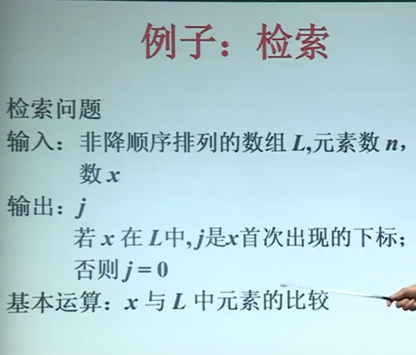
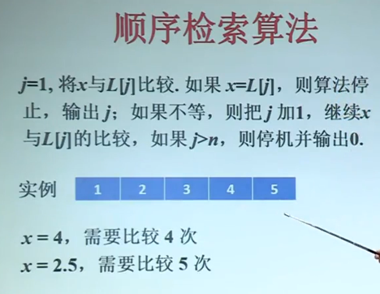
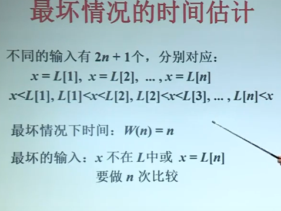
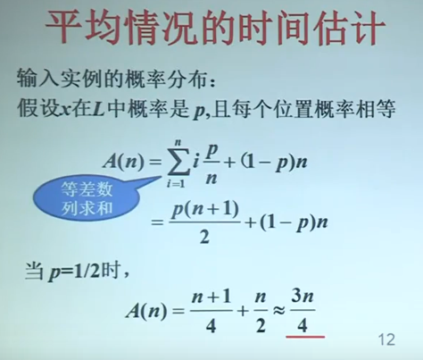
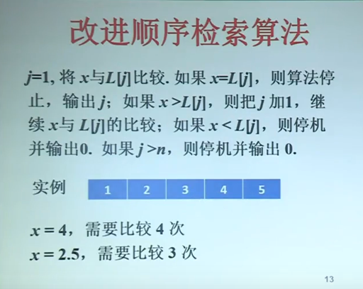
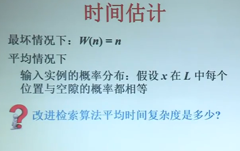

# 算法及时间复杂度的定义

## 问题以及实例：

### 问题：

需要回答的一般性提问，通常含若干==参数==

### 问题描述：

- 定义问题参数（集合，变量，函数，序列等）
- 说明每个参数的取值范围以及参数间的关系
- 定义问题的解
- 说明解满足条件（优化目标或约束条件）

### 问题实例：

参数的一组赋值可得到问题的一个实例

## 算法：

### 算法

是有限条指令的序列

这个指令序列确定了解决某个问题的一系列运算或操作

### 算法A求解问题P

- 把算法P的任何实例作为算法A的输入
- 每步计算是确定性的
- A能够在有限步完成
- 输出该实例正确的解

## 基本运算与输入规模

1. ==算法的时间复杂度==：针对指定==基本运算==，计数算法所作的运算次数
2. ==基本运算==：比较，加法，乘法，置指针，交换...
3. ==输入规模==（input）：输入串编码长度，通常用下述参数度量：数组元素数量，调度问题的任务个数，图的顶点数与边数等

算法基本运算次数可表示为输入规模的一个函数

给定问题和基本运算就决定了一个算法类（比如排序问题本质上是元素之间的比较和交换）

## 输入规模（Input）

- 排序：数组中元素个数n
- 检索：被检索数组中的元素个数n
- 整数乘法：两个整数的位数m，n
- 矩阵相乘：矩阵的行列数i、j、k
- 图的遍历：顶点数n，边数m

...

## 基本运算

- 排序：==元素之间的比较==

- 检索：被检索元素x与数组元素的 ==比较==

- 整数乘法：每位 数字相乘（位乘）1次

  m位和n位整数相乘要做mn次位乘

- 矩阵相乘:每对 ==元素乘==一次

  i*j矩阵与j×k矩阵要做ijk次乘法

- 图的遍历：置指针

## 算法的两种时间复杂度

#### 对于相同输入规模的不同实例，算法的基本运算次数也不一样，可定义两种时间复杂度：

- 最坏情况下时间复杂度W（n）

  算法求解输入规模为n的实例所需要的最长时间

- 平均情况下的复杂度A(n)

  在给定同样规模为n的输入实例的概率分布下，算法求解这些实例所需要的平均时间

## A(n)计算公式

设S为规模为n的实例集

实例 I∈S的概率是P1

算法对实例I执行的基本运算次数是
$$
A(n)=\sum_{I∈S}{P_I t_I}
$$
.在某些情况下可以假定每个输入实例概率相等

## 例子：检索

$$
W(n)=n
$$
假设l~1~<=x<=l~n~的概率为p
$$
A(n)=(1-p)/2*n+(1-p)/2*0+\sum_{i=2}^{i=n}{\frac{p}{n-1}i}
$$
