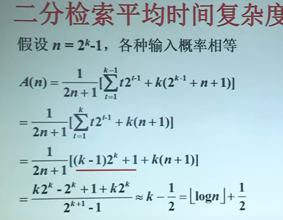

# 序列求和的方法

## 1.数列求和公式

### 1.1等差，等比数列与调和级数

- $\sum_{k=1}^{n}a^k=\frac{n(a_1+a_n)}{2}$
- $\sum_{k=0}^{n}aq^k=\frac{a(1-q^{n+1})}{1-q},\sum_{k=0}^{\infty}=\frac{a}{1-q}(q<1)$
- $\sum_{k=1}^{n}\frac{1}{k}=\ln n+O(1)$

## 2.求和的例子

$$
\sum _{t=1}^{k}t2^{t-1}
$$

$$
=\sum_{t=1}^{k}{t(2^t-2^{t-1})}(拆项)
$$

$$
=\sum_{k=1}^{k}t2^t-\sum_{k=1}^{k}t2^{t-1}
$$

$$
=\sum_{k=1}^{k}t2^t-\sum_{k=0}^{k-1}(t+1)2^t（变限）
$$

$$
=\sum_{k=1}^{k}t2^t-\sum_{k=0}^{k-1}t2^t-\sum_{k=0}^{k-1}2^t（拆项）
$$

$$
=k2^k-\frac{1-2^t}{1-2}=k2^k-(2^k-1)=(k-1)2^k+1
$$

## 二分检索算法

### 算法BinarySearch

输入：数组T，下标从l到r；数x

输出：j

1. $l\leftarrow 1;r \leftarrow n$
2. while $l\leq r$ do​
3.   $m\leftarrow \lfloor (l+r)/2\rfloor$
4.   if   $T[m]=x$   then  return  $m$
5.   else if  $T[m] > x$ then $r\leftarrow m-1$
6. ​    else $l\leftarrow m+1$
7. return 0   

### 二分检索运行实例：

## 二分查找复杂度分析

## 估计和式上界放大法

### 放大法

1. $\sum_{k=1}^{n}{a_k\leq na_{max}}$(粗糙)
2. 假设存在常数==r<1==，使得对一切$k\geq 0$有$a_{k+1}/a_k\leq r$成立

$$
\sum_{k=0}^{n}a_k \leq \sum_{k=0}^{\infty}{a_0r^k}=\frac{a_0}{1-r}
$$

sp：将有限项数组抽象为一个比小于1大于0的等比数列，该等比数列上限为$\infty$，其值收敛到$\frac{a_0}{1-r}$

### 放大法的例子：

估计$\sum_{k=1}^{n}{\frac{k}{3^k}}$的上界

解：由$a_k=\frac{k}{3^k},a_{k+1}=\frac{k+1}{3^{k+1}}$

​	$\frac{a_k}{a_{k+1}}=\frac{1}{3}\frac{k+1}{k}\leq 2/3$

得
$$
\sum_{k=1}^{n}{\frac{k}{3^k}}=\sum_{k=1}^{\infty}\frac{(2/3)^{k-1}}{3}=\frac{1}{3}*\frac{(1-(2/3)^k)}{1-(2/3)}=1
$$

## 估计和式渐进的界

估计$\sum_{k=1}^{n}\frac{1}{k}$的渐近的界
$$
\sum_{k=1}^{n}\frac{1}{k}\geq \int_{1}^{n+1}\frac{dx}{x}=ln(n+1)
$$

$$
\sum_{k+1}^{n}\frac{1}{k}=1+\sum_{k=2}^{n}\leq 1+\int_{1}^{n}{\frac{dx}{x}}=\ln n+1
$$

故
$$
\sum_{k=1}^{n}\frac{1}{k}=\Theta(\log n)
$$
