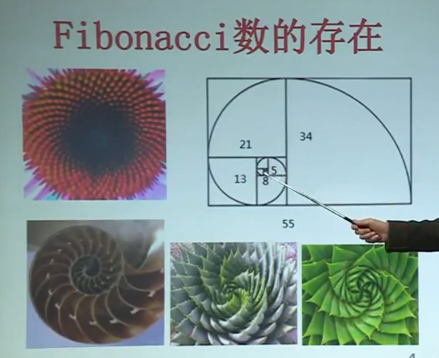
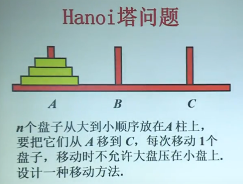

# 递推方程与算法分析

## 递推方程

设序列$a_0,a_1,...,a_n,...$简记为{$a_n$}

一个把$a_n$与某个$a_i(i<n)$联系起来的等式叫关于序列{$a_n$}的==递推方程==

### 递推方程的求解：

给定关于序列{$a_n$}的递推方程和若干初值，计算$a_n$，

### 递推方程的例子

Fibonacci数列：

1，1，2，3，5，8，13，21，34，55，..

递推方程：$f_n=f_{n-1}+f_{n-2}$

初值：$f_0=1,f_1=1$
$$
f_n=\frac{1}{\sqrt{5}}(\frac{1+\sqrt{5}}{2})^{n+1}-\frac{1}{\sqrt{5}}(\frac{1-\sqrt{5}}{2})^{n+1}
$$



## Hanoi塔问题：



#### 递归算法

```
Hanoi(A,C,n){
	if n=1 then move(A,C)
	else Hanoi(A,B,n-1)
		move(A,C)
		Hanoi(B,C,n-1)
}
```

设n个盘子的移动次数为T（n）

$T(n)=2T(n-1)+1$,

$T(1)=1$

### 分析算法

$T(n)=2T(n-1)+1$,$T(1)=1$
$$
\therefore T(n)=2^n-1
$$
一秒钟移动一个的话，64个盘子要多久？

答：5000亿年

千万亿次每秒，

4H


### 有没有更好的算法

没有！这是一个难解的问题，不存在多项式时间的算法

## 插入排序

```
Insert_Sort(A,n):{
	for(j=2;j<=n;j++){
		x=A[j];
		i=j-1;
		while (i>0 && x<A[i]){
			A[i+1]=A[i];
			i=i-1;
    	}
    	A[i+1]=x
	}
}
```

### 最坏情况下的时间复杂度

设基本运算是元素比较，对规模为n的输入最坏情况下的时间复杂度为W（n）

排序第n个数时，默认前面n个数已经排序完毕，第n次在最坏情况下会与前面n-1个数比较

$W(n)=W(n)+n-1$,

$W(1)=0$

解为

$W(n)=n(n-1)/2$

