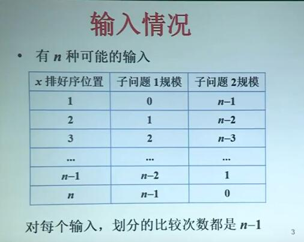

# 消差法化简高阶递推方程

## 对于快速排序

假设A[q..r]的元素彼此不相等

以首元素A[1]对数组A[q..r]划分，使得

- 小于x的元素放在A[p..q-1]
- 大于x的元素放在A[q+1..r]

递归对于A[p..q-1]和A[q+1..r]排序

==工作量==：子问题工作量+划分工作量

由首元素的大小不同有n种输入情况：

### 工作量总和：

$$
T(0)+T(n-1)+n-1\\T(1)+T(n-1)+n-1\\T(2)+T(n-)+n-1\\...\\T(n-1)+T(0)+n-1\\
$$

加和后结果：

$$
2[\sum_{k=1}^{n-1}{T(k)}]+n(n-1)
$$

### 快速排序的平均工作量：

假设首元素排好序在每个位置的概率是相等的
$$
T(n)=\frac{2}{n}\sum_{i=1}^{n-1}T(i)+O(n),n\geq 2\\T(1)=0
$$
全部历史递推方程，

对于高阶方程应该先==化简==，然后==迭代==

因为每次迭代都会出现n-1个项，

最好先将其化简为1阶的方程

## 差消化简

利用两个方程相减，将右边的项尽可能消去，以达到降阶的目的
$$
T(n)=\frac{2}{n}\sum_{i=1}^{n-1}T(i)+cn\\nT(n)=2\sum_{i=1}^{n-1}{T(i)}+cn^2...1\\(n-1)T(n-1)=2\sum_{i=i}^{n-2}T(i)+c(n-1)^2 ...2（换元）
$$
将后面两个等式1、2相减可得：
$$
nT(n)-(n-1)T(n-1)=2T(n-1)+2(2n-1)
$$
至此，该方程从n-1阶变成1阶
$$
\therefore\ nT(n)=(n+1)T(n-1)+c_1n
$$
但此时T前依然有系数，迭代依然比较困难；

于是我们把双方同时除以n(n+1)
$$
\frac{T(n)}{n+1}=\frac{T(n-1)}{n}+\frac{c_1}{n+1}
$$

## 迭代求解

$$
\frac{T(n)}{n+1}=\frac{T(n-1)}{n}+\frac{c_1}{n+1}=...\\=\frac{T(1)}{2}+c_1[\frac{1}{n+1}+\frac{1}{n}+...+\frac{1}{3}]\\=c_1[\frac{1}{n+1}+\frac{1}{n}+...+\frac{1}{3}]\\=\Theta (\log n)\\\therefore \ \ T(n)=\Theta(n\log n)
$$

