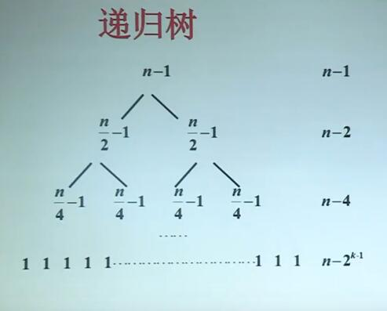

# 6.递归树

## 递归树的概念

- 递归树是迭代计算的模型
- 递归树的生成过程与迭代过程一致
- 递归树上所有项恰好是迭代之后产生和式中的项
- 对递归树上的项求和就是迭代后方程的解

## 迭代在递归树中的表示

如果的递归树上某节点标记为W（m）
$$
W(m)=W(m_1)+...+W(m_t)\\
+f(m)+...+g(m),m_1,...,m_t<m
$$
其中$W(m_1),...,W(m_t)$称为函数项

### 二层子树的例子

二分归并排序
$$
W(n)=2W(n/2)+n-1
$$

## 递归树的生成规则

- 初始，递归树只有根节点，其值为$W(n)$

- 不断继续下述过程：

  将函数项叶节点的迭代式$W(n)$表示成二层子树

  用子树替换该叶节点

- 继续递归树的生成，直到树中无函数项（只有初值）为之

## 递归树的生成实例

## 对递归树上的量求和

$$
W(n)=2W(n/2)+n-1,n=2^k\\W(1)=0
\\
\\W(n)=n-1+n-2+...+n-n^{k-1}
\\=kn-(2^k-1)
\\=n\log n-n+1
$$

## 递归树应用实例

求解方程$T(n)=T(n/3)+T(2n/3)+n$

### 求和：

方程：$T(n)=T(n/3)+T(2n/3)+n$

递归树层数k，每层O(n)
$$
n(2/3)^k=1
\\(3/2)^k=n
\\k=O(\log_{3/2}n)
\\\therefore \ O(n\log n)
$$

## 小结

- 递归树是迭代的图形表示
- 递归树的生成规则
- 如何利用递归树求解递推方程

