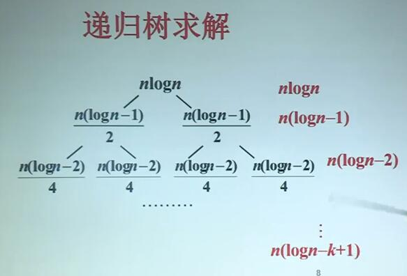

# 8.主方法的应用

## 求解递推方程：例1

求解递推方程

$T(n)=9T(n/3)+n$

解 上述递推方程中
$$
a=9\ ,b=3 \ ,f(n)=n
\\n^{log_39}=n^2 ,\ f(n)=O(n^{log_{3}9-1})
\\此处满足主定理的第一项
\\相当于主定理的case1，其中\epsilon =1.
\\根据定理得到：T(n)=\Theta(n^2)
$$

## 求解递推方程：例2

求解递推方程

$T(n)=T(2n/3)+1$

解 上述递推方程中
$$
a=1,\ b=3/2,\ f(n)=1, 
\\n^{log_{3/2}1}=n^0=1
\\相当于主定理Case2
\\根据定理得到T(n)=\Theta(\log n)
$$

## 求解递推方程：例3

求解递推方程

$T(n)=3T(n/4)+n\log n$

解 上述递推方程中
$$
a=3 \ ,b=b,f(n)=n\log n,
\\n\log n=\Omega(n^{log_4{3+\epsilon}})\approx\Omega(n^{0.793+\epsilon})
\\取\epsilon=0.2即可
\\要使af(n/b)\leq cf(n)成立
\\代入f(n)=n\log n,得到
\\3(n/4)\log(n/4)\leq cn\log n
\\只要c\geq 3/4成立，上述不等式可以对所有充分大的n成立。
\\相当于主定理的Case3
\\因此有T(n)=\Theta(f(n))=\Theta(n\log n)
$$

## 递归算法分析

### 二分检索

$W(n)=W(n/2)+1,W(1)=1$
$$
a=1,b=2,n^{log_21}=1,f(n)=1
\\满足Case2
\\W(n)=\Theta(\log n)
$$

### 二分归并排序

$W(n)=2W(n/2)+n-1,W(1)=0$
$$
a=2,b=2,n-1=\Theta(n^{log_22})
\\属于Case2
\\W(n)=\Theta(n\log n)
$$

## 不能使用主定理的例子

求解$T(n)=2T(n/2)+n\log n$

解
$$
a=b=2,n^{\log_{b}a}=n,f(n)=n\log{n}
\\\therefore不存在\epsilon >0使下式成立
\\n\log{n}=\Omega(n^{1+\epsilon})
\\也不存在c<1使得af(n/b)\leq cf(n)对所有充分大的n成立
\\故下式不成立
\\2(n/2)\log{(n/2)}=n(logn-1)\leq n\log{n}
\\故该式不能使用主定理
$$

$\frac{n}{2^{k}}=1$

求和:
$$
T(n)=n\log{n}+n(\log{n}-1)+...+n(\log{n}-k+1)
\\=(n\log{n})\log{n}-n(1+2+...+k-1)
\\=n\log^2n-nk(k-1)/2=O(n\log^{2}n)
$$
