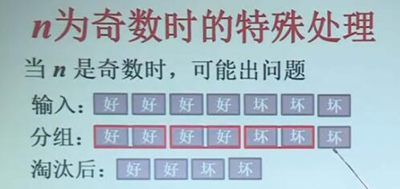

# 3.芯片测试

==假设==：好芯片的报告一定是正确的，坏芯片的报告是不确定的

## 问题：

### 输入：

n片芯片，其中好芯片比至少比坏芯片多一片

### 要求：

使用最少的测试次数

## 判定芯片A的好坏

### 问题：

给定芯片A，判定芯片A的好坏

### 方法：

用其他n-1片芯片对A的测试

n=7：好芯片数$\geq4$

- A好，六个报告中至少三个报“好”
- A坏，六个报告中至少四个报“坏”

若n=8：好芯片数$\geq 5$

- A好，7个报告中至少4个报“好”
- A坏，7个报告中至少5个报“坏”

n是==奇数==：好芯片数$\geq(n+1)/2$

- A好，至少有$(n-1)/2$个报“好”
- A坏，至少有$(n+1)/2$个报“坏”

n是==偶数==：好芯片数$\geq n/2+1$

- A好，至少有n/2个报告“好”
- A坏，至少有n/2+1个报告“坏”

### 结论：

n-1份报告中：

至少一半报“好”，A是好芯片

超过一半报“坏”，A是坏芯片

## 蛮力算法

### 测试方法：

任取1片测试，如果是好芯片，测试结束；如果是坏芯片，抛弃，再从剩下芯片中任取一片测试，直到得到1片好芯片

### 时间估计

第1片芯片，最多测试n-2次，

第2片芯片，最多测试n-3次，

...

总计$\Theta(n^2)$

## 分治算法设计思想

假设n为偶数，将n片芯片两两一组做测试淘汰，剩下芯片构成子问题，进入下一轮分组淘汰

### 淘汰规则：

“好，好”：任留一片，进入下轮

其他情况：全部抛弃

### 递归截止条件：$n\leq3$

3片芯片，一次测试可得到好芯片。

一片或两片不再需要测试

ps：因为n中有n/2+1个好芯片，所以递归到3时，好芯片数量一定大于坏芯片

三个中任挑一对测试，

结果为“好，好”则这两个为好芯片

“坏，坏”结果不存在

其他结果：好的和剩下的为好芯片

## 分治算法的正确性

### 命题1：

当n时偶数时，在上述淘汰规则下，经过一轮的淘汰，剩下的好芯片比坏芯片至少多一片

证 设A,B都好的芯片i组，A与B一好一坏j组，A与B都坏k组。淘汰后好芯片至少i，坏芯片至多k
$$
2i+2j+2k=n
\\2i+j>2k+j
\\\therefore i>k
$$

### n为奇数时的特殊处理

当n是奇数时，可能出现问题

处理办法：当n为奇数时，增加一轮对轮空芯片的单独测试，所有芯片与此芯片对比

如果该芯片为好芯片，算法结束，如果是坏芯片，则淘汰

## 伪码描述

## 时间复杂度分析

设输入规模为n

每轮淘汰后，芯片数至少减半

测试次数（含轮空处理）：O(n)

时间复杂度：
$$
W(n)=W(n/2)+O(n)
\\W(3)=1,W(2)=W(1)=0
$$
根据主定理case3、

解得：$W(n)=O(n)$

## 小结：

- 芯片测试的分治算法
  - 如何保证子问题与原问题性质相同
  - 增加轮空处理
  - 额外处理工作量不改变函数的阶
  - 时间复杂度为$O(n)$