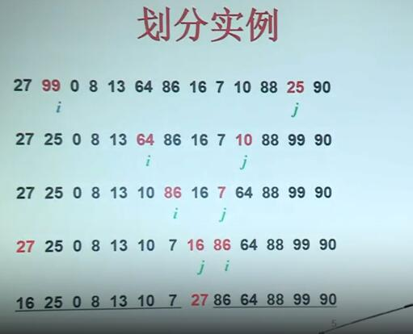
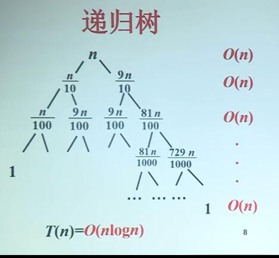

# 4.快速排序

## 基本思想

- 用首元素x作划分标准，将输入数组A划分成不超过x的元素构成的数组$A_L$,大于x的元素构成的数组$A_R$，其中，$A_L,A_R$从左到右存放在数组A的位置
- 递归地对子问题$A_L$和$A_R$进行排序，直到子问题规模为1时停止

## 伪码

算法Quicksort(A,p,r)

输入:数组$A[p..r]$

输出：排好序的数组A

1. $if\ p<r$
2. $then\ q\leftarrow Partition(A,p,r)$
3. ​    $A[p]\Leftrightarrow A[q]$ ##交换位置
4. ​    Quicksort(A,p,q-1)
5. ​    Quicksort(A,q+1,r)

初始置p=1，r=n，然后调用上述算法

### 划分过程

Partition(A,p,r)

1. $x\leftarrow A[p]$ //首元素
2. $i\leftarrow p$ #头指针指向首元素
3. $j\leftarrow r+1$ #尾指针指向数组尾的后一个空元素
4. while ture do
5. ​    repeat $j\leftarrow j-1$
6. ​    until $A[j]\le x$ //不超过首元素的
7. ​    repeat $i\leftarrow i+1$
8. ​    until $A[i]>x$ //比首元素大的
9. ​    if i<j 
10. ​    then $A[i]\Leftrightarrow A[j]$
11. ​    else return j

## 划分实例

## 时间复杂度

### 最坏情况：

数组头的值是整个数组的最小值或最大值

$W(n)=W(n-1)+n-1$

$W(1)=0$

$W(n)=n(n-1)/2$

### 最好情况

数组头的值是整个数的中位数

$T(n)=2T(n/2)+n-1$

$T(1)=0$

$T(n)=\Theta(n\log{n})$(主函数定理2)

### 均衡划分时间复杂度

均衡划分：子问题的规模比不变

例如1：9

$T(n)=T(n/10)+T(9n/10)+n$

$T(1)=0$

根据递归树，时间复杂度尾

$T(n)=\Theta (n\log{n})$

### 平均时间复杂度

首元素排好序后在1，2，...，n

各种情况的概率均为1/n

- 首元素在位置1： $T(0),T(n-1)$
- 首元素在位置2： $T(1),T(n-2)$
- ...
- 首元素在位置n-1： $T(n-2),T(1)$
- 首元素在位置n： $T(n-1),T(0)$

子问题工作量：$2[T(1)+T(2)+...T(n-1)]$

划分工作量 n-1

$T(n)=\frac{1}{n}\sum_{k=1}^{n-1}(T(k)+T(n-k))+n-1$

$T(n)=\frac{2}{n}\sum_{k=1}^{n-1}(T(k))+n-1$

$T(1)=0$

$T(n)=\Theta(n\log{n})$

首元素划分后每个位置概率相等

## 小结

快速排序算法

- 分治策略
- 子问题划分是由首元素决定
- 最坏情况下时间$O(n^2)$
- 平均情况下时间为$O(n\log{n})$