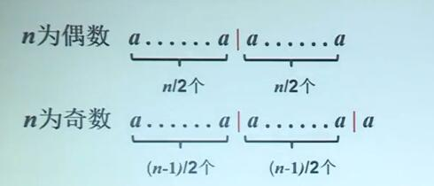

# 5.幂乘算法及应用

## 幂乘问题

输入：a为给定的实数，n为自然数

输出：$a^n$

传统算法：顺序相乘

​	$a^n=(...(((aa)a)a)...)a$

乘法次数:$\Theta(n)$

## 分治算法-划分

$$
a^n=\left\{\begin{array}{rcl}
a^{n/2}\times a^{n/2}\ \ \ \ n为偶数\\
a^{(n-1)/2}\times a^{(n-1)/2} \times a\ \ \ \ n为奇数
\end{array}\right.
$$

## 分治算法分析

以乘法作为基本运算

- 子问题规模：不超过n/2
- 两个规模近似n/2的子问题完全一样，则只需计算一次

由此得到

$W(n)=W(n/2)+\Theta(1)$

$W(n)=\Theta(\log{n})$

## 幂乘算法的应用

Fibonacci数列：1,1,2,3,5,8,13,21..

增加$F_0$=0,得到数列

0，1，1，2，3，5，8，13，21...

问题：已知$F_0=0,F_1=1$,给定n，计算$F_n$

通常算法：从$F_0,F_1,...$开始，根据递推公式
$$
F_n=F_{n-1}+F_{n-2}
$$
陆续相加可得$F_n$,时间复杂度为$\Theta(n)$

## Fabonacci数的性质

==定理1==设{$F_n$}为Fibonacci数构成的数列，那么
$$
\left[\begin{array}{cc|r}
F_{n+1}&F_n\\
F_n&F_{n-1}
\end{array}\right]=\left[\begin{array}{cc|r}
1&1\\
1&0
\end{array}\right]^{n}
$$

归纳证明：

n=1,$左边=\left[\begin{array}{cc|r}
F_{2}&F_1\\
F_1&F_{0}
\end{array}\right]=\left[\begin{array}{cc|r}
1&1\\
1&0
\end{array}\right]=右边$

假设对于任意正整数n，命题成立，即
$$
\left[\begin{array}{cc|r}
F_{n+1}&F_n\\
F_n&F_{n-1}
\end{array}\right]=\left[\begin{array}{cc|r}
1&1\\
1&0
\end{array}\right]^{n}
$$
那么$\left[\begin{array}{cc|r}
F_{n+2}&F_{n+1}\\
F_{n+1}&F_{n}
\end{array}\right]=\left[\begin{array}{cc|r}
F_{n+1}&F_n\\
F_n&F_{n-1}
\end{array}\right]\left[\begin{array}{cc|r}
1&1\\
1&0
\end{array}\right]$

$=\left[\begin{array}{cc|r}
1&1\\
1&0
\end{array}\right]^n\left[\begin{array}{cc|r}
1&1\\
1&0
\end{array}\right]=\left[\begin{array}{cc|r}
1&1\\
1&0
\end{array}\right]^{n+1}$

## 算法

另矩阵$M=\left[\begin{array}{cc|r}
1&1\\
1&0
\end{array}\right]$,用幂乘法计算$M^n$

时间复杂度：

- 矩阵乘法次数	$T(n)=\Theta(\log{n})$
- 每次矩阵乘法需要做8次元素相乘，4次相加
- 从机元素相乘次数为$\Theta(log{n})$

## 小结

- 分治算法的例子——幂乘算法
- 幂乘算法的应用
  - 计算Fibonacci数
  - 通常算法$O(n)$，分治算法为$O(\log{n})$

